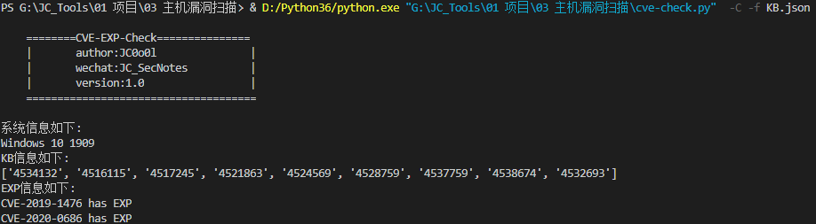
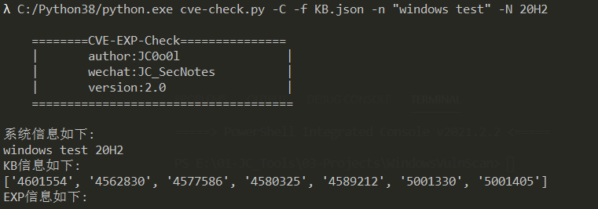

### 0x00 说明：

这是一款基于主机的漏洞扫描工具，采用多线程确保可以快速的请求数据，采用线程锁可以在向sqlite数据库中写入数据避免`database is locked`的错误，采用`md5`哈希算法确保数据不重复插入。

本工具查找是否有公开exp的网站为`shodan`,该网站限制网络发包的速度，因而采用了单线程的方式，且耗时较长。

**功能：**

- 查找主机上具有的CVE
- 查找具有公开EXP的CVE



### 0x01 起因：

因为需要做一些主机漏洞扫描方面的工作，因而编写了这个简单的工具。之前也查找了几款类似的工具，如下：

`vulmap`:

> vulmon开发的一款开源工具，原理是根据软件的名称和版本号来确定，是否有CVE及公开的EXP。这款Linux的工具挺好用，但是对于Windows系统层面不太适用。

`windows-exp-suggester`:

> 这款和本工具的原理一样，尝试使用了之后，发现它的CVEKB数据库只更新到2017年的，并且没有给出CVE是否有公开的EXP信息。

基于以上所以写了这个简单的工具,该项目在[https://github.com/chroblert/WindowsVulnScan](https://github.com/chroblert/WindowsVulnScan)

### 0x02 原理：

1\. 搜集CVE与KB的对应关系。首先在微软官网上收集CVE与KB对应的关系，然后存储进数据库中

2\. 查找特定CVE网上是否有公开的EXP

3\. 利用powershell脚本收集主机的一些系统版本与KB信息

4\. 利用系统版本与KB信息搜寻主机上具有存在公开EXP的CVE

### 0x03 参数：

```shell
# author: JC0o0l
# GitHub: https://github.com/chroblert/
可选参数:
  -h, --help            show this help message and exit
  -u, --update-cve      更新CVEKB数据
  -U, --update-exp      更新CVEEXP数据
  -m MODE, --mode MODE  搭配-U使用。更新模式 All:更新所有;Empty:只更新空白的;Error:只更新之前未成功更新的
  -C, --check-EXP       检索具有EXP的CVE
  -n PRODUCTNAME, --productName PRODUCTNAME
                        搭配-C使用。自定义产品名称，如Windows 10
  -N PRODUCTVERSION, --productVersion PRODUCTVERSION
                        搭配-C使用。自定义产品版本，如20H2
  -f FILE, --file FILE  ps1脚本运行后产生的.json文件
```

### 0x04 示例：

1\. 首先运行powershell脚本`KBCollect.ps`收集一些信息

```shell
.\KBCollect.ps1
```

2\. 将运行后产生的`KB.json`文件移动到`cve-check.py`所在的目录

3\. 安装一些python3模块

```shell
python3 -m pip install requirements.txt
```

4\. 运行`cve-check.py -u`创建CVEKB数据库

5\. 运行`cve-check.py -U`更新CVEKB数据库中的`hasPOC`字段
```shell
  此处可以使用-m选择更新模式。
  -m All:更新所有
  -m Empty:只更新hasPOC字段为空的
  -m Error:只更新hasPOC字段为Error的
```
6\. 运行`cve-check.py -C -f KB.json`查看具有公开EXP的CVE，如下：


7\. 若使用脚本扫描到的系统名称和版本不准确，可以使用`-n,-N`进行指定




### 0x05 版本：

**version1**: 20201207

**version2**: 20210427
- 更新微软网址
- 可以指定数据库更新模式
- 可以指定系统名称，系统版本